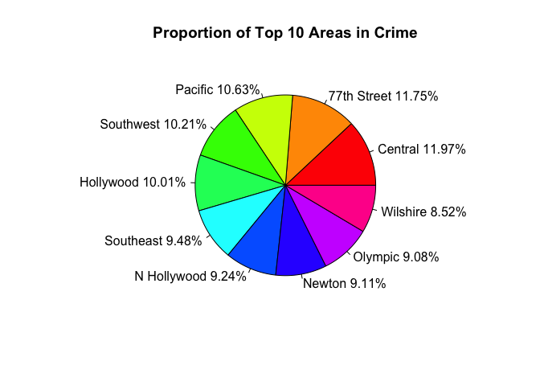
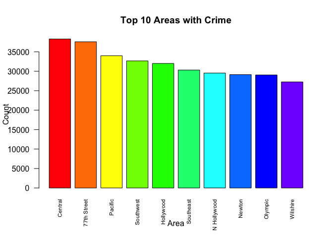
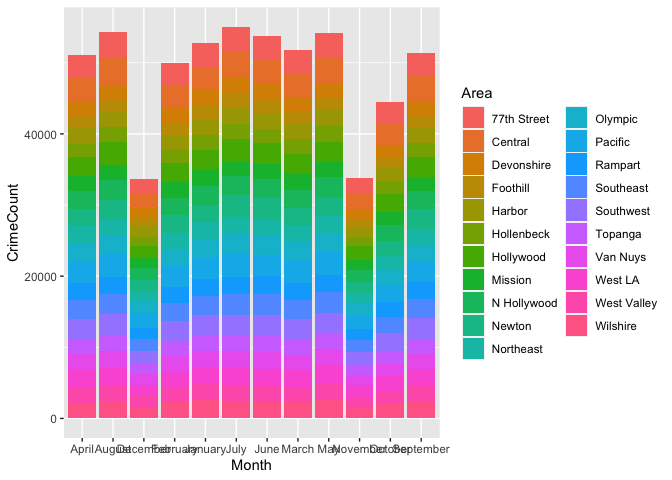
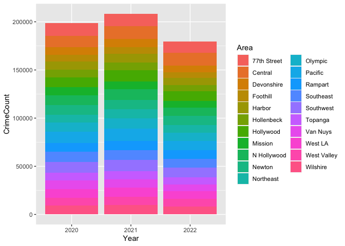
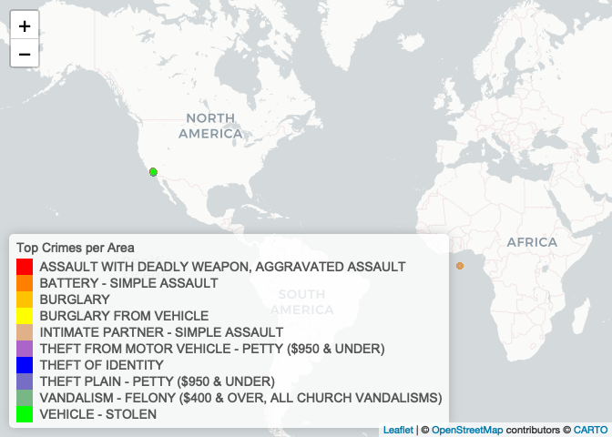

pm566-midterm-draft2
================
Misha Khan
2022-10-22

``` r
library(stringr)
library(dplyr)
```

    ## 
    ## Attaching package: 'dplyr'

    ## The following objects are masked from 'package:stats':
    ## 
    ##     filter, lag

    ## The following objects are masked from 'package:base':
    ## 
    ##     intersect, setdiff, setequal, union

``` r
library(tidyverse)
```

    ## ── Attaching packages
    ## ───────────────────────────────────────
    ## tidyverse 1.3.2 ──

    ## ✔ ggplot2 3.3.6     ✔ readr   2.1.2
    ## ✔ tibble  3.1.8     ✔ purrr   0.3.4
    ## ✔ tidyr   1.2.1     ✔ forcats 0.5.2
    ## ── Conflicts ────────────────────────────────────────── tidyverse_conflicts() ──
    ## ✖ dplyr::filter() masks stats::filter()
    ## ✖ dplyr::lag()    masks stats::lag()

``` r
library(rvest)
```

    ## 
    ## Attaching package: 'rvest'
    ## 
    ## The following object is masked from 'package:readr':
    ## 
    ##     guess_encoding

``` r
library(xml2)
library(dbplyr)
```

    ## 
    ## Attaching package: 'dbplyr'
    ## 
    ## The following objects are masked from 'package:dplyr':
    ## 
    ##     ident, sql

``` r
library(dplyr)
library(skimr) 
library(ggplot2)
library(data.table)
```

    ## 
    ## Attaching package: 'data.table'
    ## 
    ## The following object is masked from 'package:purrr':
    ## 
    ##     transpose
    ## 
    ## The following objects are masked from 'package:dplyr':
    ## 
    ##     between, first, last

``` r
library(lubridate)
```

    ## 
    ## Attaching package: 'lubridate'
    ## 
    ## The following objects are masked from 'package:data.table':
    ## 
    ##     hour, isoweek, mday, minute, month, quarter, second, wday, week,
    ##     yday, year
    ## 
    ## The following objects are masked from 'package:base':
    ## 
    ##     date, intersect, setdiff, union

``` r
library(leaflet)
library(webshot)
```

Topic: Crime Data from 2020 to Present in Los Angeles Missing data (0,
0) for long and lat are for privacy URL:
<https://data.lacity.org/Public-Safety/Crime-Data-from-2020-to-Present/2nrs-mtv8>

``` r
crimeraw <- read.csv("Crime_Data_from_2020_to_Present.csv")
```

Data Cleaning Rename cols to make it more meaningful

``` r
colnames(crimeraw) <- c('Record No',
                        'Date Reported',
                        'Date Occurred',
                        'Time Occurred',
                        'Area No',
                        'Area',
                        'Rpt Dist No', #drop
                        'Part', #drop
                        'Crime Code',
                        'Crime',
                        'MO', #drop
                        'Victim Age',
                        'Victim Sex',
                        'Victim Ethnicity',
                        'Premise Code',
                        'Premise',
                        'Weapon Code',
                        'Weapon',
                        'Case Code',
                        'Case Status',
                        'Crime Code 1',
                        'Crime Code 2',
                        'Crime Code 3',
                        'Crime Code 4',
                        'Location',
                        'Cross Street',
                        'Lat',
                        'Lon'
                        )

crimeraw <- select(crimeraw, -c('Rpt Dist No','Part', 'MO','Crime Code 1', 'Crime Code 2', 'Crime Code 3', 'Crime Code 4', 'Cross Street'))
```

Reformat date variables (EDA: Date when most crimes occur)

``` r
crimeraw$`Date Reported` <- as.Date(crimeraw$`Date Reported`, format = "%m/%d/%Y")
crimeraw$`Date Occurred` <- as.Date(crimeraw$`Date Occurred`, format = "%m/%d/%Y")
```

Change miltary to standard time (Possible EDA: Time when most crime
occur)

``` r
crimeraw$`Time Occurred` <- format(strptime(substr(as.POSIXct(sprintf("%04.0f", crimeraw$`Time Occurred`), 
                                 format="%H%M"), 12, 16), '%H:%M'), '%I:%M %p')
```

View missing data

``` r
skimr::skim(crimeraw)
```

|                                                  |          |
|:-------------------------------------------------|:---------|
| Name                                             | crimeraw |
| Number of rows                                   | 586295   |
| Number of columns                                | 20       |
| \_\_\_\_\_\_\_\_\_\_\_\_\_\_\_\_\_\_\_\_\_\_\_   |          |
| Column type frequency:                           |          |
| character                                        | 10       |
| Date                                             | 2        |
| numeric                                          | 8        |
| \_\_\_\_\_\_\_\_\_\_\_\_\_\_\_\_\_\_\_\_\_\_\_\_ |          |
| Group variables                                  | None     |

Data summary

**Variable type: character**

| skim_variable    | n_missing | complete_rate | min | max |  empty | n_unique | whitespace |
|:-----------------|----------:|--------------:|----:|----:|-------:|---------:|-----------:|
| Time Occurred    |         0 |             1 |   8 |   8 |      0 |     1439 |          0 |
| Area             |         0 |             1 |   6 |  11 |      0 |       21 |          0 |
| Crime            |         0 |             1 |   5 |  56 |      0 |      137 |          0 |
| Victim Sex       |         0 |             1 |   0 |   1 |  77585 |        5 |          0 |
| Victim Ethnicity |         0 |             1 |   0 |   1 |  77590 |       20 |          0 |
| Premise          |         0 |             1 |   0 |  63 |    270 |      307 |          0 |
| Weapon           |         0 |             1 |   0 |  46 | 378391 |       79 |          0 |
| Case Code        |         0 |             1 |   2 |   2 |      0 |        5 |          0 |
| Case Status      |         0 |             1 |   9 |  12 |      0 |        5 |          0 |
| Location         |         0 |             1 |   1 |  40 |      0 |    58964 |          0 |

**Variable type: Date**

| skim_variable | n_missing | complete_rate | min        | max        | median     | n_unique |
|:--------------|----------:|--------------:|:-----------|:-----------|:-----------|---------:|
| Date Reported |         0 |             1 | 2020-01-01 | 2022-10-17 | 2021-07-05 |     1021 |
| Date Occurred |         0 |             1 | 2020-01-01 | 2022-10-17 | 2021-06-24 |     1021 |

**Variable type: numeric**

| skim_variable | n_missing | complete_rate |          mean |         sd |      p0 |           p25 |           p50 |           p75 |          p100 | hist  |
|:--------------|----------:|--------------:|--------------:|-----------:|--------:|--------------:|--------------:|--------------:|--------------:|:------|
| Record No     |         0 |          1.00 | 210993981\.06 | 8054284.32 |  817.00 | 201612952\.50 | 211106639\.00 | 220413503\.50 | 229921795\.00 | ▁▁▁▁▇ |
| Area No       |         0 |          1.00 |         10.73 |       6.08 |    1.00 |          6.00 |         11.00 |         16.00 |         21.00 | ▇▆▆▆▆ |
| Crime Code    |         0 |          1.00 |        502.92 |     208.79 |  110.00 |        330.00 |        442.00 |        626.00 |        956.00 | ▃▇▂▆▂ |
| Victim Age    |         0 |          1.00 |         29.98 |      21.68 |   -1.00 |         12.00 |         31.00 |         45.00 |        120.00 | ▆▇▃▁▁ |
| Premise Code  |         6 |          1.00 |        301.94 |     216.05 |  101.00 |        101.00 |        203.00 |        501.00 |        971.00 | ▇▁▅▁▁ |
| Weapon Code   |    378391 |          0.35 |        361.53 |     124.11 |  101.00 |        308.00 |        400.00 |        400.00 |        516.00 | ▂▁▁▇▃ |
| Lat           |         0 |          1.00 |         33.94 |       2.12 |    0.00 |         34.01 |         34.06 |         34.16 |         34.33 | ▁▁▁▁▇ |
| Lon           |         0 |          1.00 |       -117.90 |       7.34 | -118.67 |       -118.43 |       -118.32 |       -118.27 |          0.00 | ▇▁▁▁▁ |

MISSING: Weapon Code EMPTY: Victim Sex, Victim Ethnicity, Premise,
Weapon IF missing, change to 999 FIX: empty cells will not change to
value or NA

``` r
crimeraw$`Weapon Code` <- crimeraw$`Weapon Code` %>% replace_na(999)
```

New dataset created *START HERE*

``` r
#Save as changes as a new file
#write_rds(crimeraw, "crimedatnew.rds")
crimedat <- read_rds("crimedatnew.rds")
crimecopy <- crimedat
crimedat <- as.data.frame(crimedat)
```

EDA: What is the amount of crime per area in LA from 2020-2022? What is
the proportion of crime?

``` r
crime_frequency <-count(crimedat, Area)
nc <- sum(crime_frequency$n)

crime_frequency %>% 
  arrange(desc(n)) %>%
  mutate(Percent = round( n / nc * 100, 2))  %>%
knitr::kable()
```

| Area        |     n | Percent |
|:------------|------:|--------:|
| Central     | 38284 |    6.53 |
| 77th Street | 37588 |    6.41 |
| Pacific     | 34004 |    5.80 |
| Southwest   | 32659 |    5.57 |
| Hollywood   | 32011 |    5.46 |
| Southeast   | 30317 |    5.17 |
| N Hollywood | 29541 |    5.04 |
| Newton      | 29148 |    4.97 |
| Olympic     | 29054 |    4.96 |
| Wilshire    | 27267 |    4.65 |
| Rampart     | 27100 |    4.62 |
| West LA     | 26995 |    4.60 |
| Northeast   | 25533 |    4.35 |
| Harbor      | 24786 |    4.23 |
| Van Nuys    | 24687 |    4.21 |
| West Valley | 24282 |    4.14 |
| Mission     | 23757 |    4.05 |
| Topanga     | 23744 |    4.05 |
| Devonshire  | 23090 |    3.94 |
| Hollenbeck  | 22364 |    3.81 |
| Foothill    | 20084 |    3.43 |

``` r
crime_frequency <- crime_frequency %>% arrange(desc(n))
```

``` r
# Pie Chart with Percentages
slices <- crime_frequency$n[1:10]
lbls <- c("Central", "77th Street", "Pacific", "Southwest", "Hollywood", "Southeast", "N Hollywood", "Newton", "Olympic", "Wilshire")
pct <- round(slices/sum(slices)*100, 2)
lbls <- paste(lbls, pct) # add percents to labels
lbls <- paste(lbls,"%",sep="") # ad % to labels
pie(slices,labels = lbls, col=rainbow(length(lbls)),
   main="Proportion of Top 10 Areas in Crime")
```

<!-- -->
Visualization of top 10 areas

``` r
v1 <- table(crimedat$`Area`)
barplot(sort(v1, T)[1:10], las = 2, col = rainbow(12), cex.names= .7, main = "Top 10 Areas with Crime", xlab = "Area", ylab = "Count")     
```

<!-- -->

Get month before counting crimes by month and area.

``` r
crimedat$Month = format(crimedat$`Date Occurred`, "%B")
```

\#MY EDITS

``` r
#Create CrimeCount col for the Area
crime_count_month <-   #Instead of changing org dataframe (crimedat), I create a new df
  crimedat %>%
  group_by(Month, `Area`) %>% 
  summarize(CrimeCount = n())
```

    ## `summarise()` has grouped output by 'Month'. You can override using the
    ## `.groups` argument.

Find month with the highest crime (3 years of data)

``` r
crime_count_month %>%
ggplot(aes(x = Month, y = CrimeCount, fill = Area)) +
  geom_bar(stat = "identity")
```

<!-- -->

``` r
crimedat$Year = format(crimedat$`Date Occurred`, "%Y")
```

``` r
#Create CrimeCount col for the Area
crime_count_year <-   
  crimedat %>%
  group_by(Year, `Area`) %>% 
  summarize(CrimeCount = n())
```

    ## `summarise()` has grouped output by 'Year'. You can override using the
    ## `.groups` argument.

Find year with the highest crime (3 years of data)

``` r
crime_count_year %>%
ggplot(aes(x = Year, y = CrimeCount, fill = Area)) +
  geom_bar(stat = "identity")
```

<!-- -->

Find the most reported crime

``` r
crimedat %>%
  group_by(`Crime Code`, `Crime`) %>%
  summarise(n = n())  %>% 
  arrange(desc(n)) %>%
  knitr::kable()
```

    ## `summarise()` has grouped output by 'Crime Code'. You can override using the
    ## `.groups` argument.

| Crime Code | Crime                                                     |     n |
|-----------:|:----------------------------------------------------------|------:|
|        510 | VEHICLE - STOLEN                                          | 64211 |
|        624 | BATTERY - SIMPLE ASSAULT                                  | 46785 |
|        330 | BURGLARY FROM VEHICLE                                     | 37141 |
|        740 | VANDALISM - FELONY (\$400 & OVER, ALL CHURCH VANDALISMS)  | 37107 |
|        310 | BURGLARY                                                  | 35780 |
|        230 | ASSAULT WITH DEADLY WEAPON, AGGRAVATED ASSAULT            | 34715 |
|        354 | THEFT OF IDENTITY                                         | 34388 |
|        440 | THEFT PLAIN - PETTY (\$950 & UNDER)                       | 30387 |
|        626 | INTIMATE PARTNER - SIMPLE ASSAULT                         | 30327 |
|        420 | THEFT FROM MOTOR VEHICLE - PETTY (\$950 & UNDER)          | 23957 |
|        210 | ROBBERY                                                   | 20713 |
|        331 | THEFT FROM MOTOR VEHICLE - GRAND (\$950.01 AND OVER)      | 18966 |
|        341 | THEFT-GRAND (\$950.01 & OVER)EXCPT,GUNS,FOWL,LIVESTK,PROD | 18140 |
|        745 | VANDALISM - MISDEAMEANOR (\$399 OR UNDER)                 | 17311 |
|        930 | CRIMINAL THREATS - NO WEAPON DISPLAYED                    | 12244 |
|        442 | SHOPLIFTING - PETTY THEFT (\$950 & UNDER)                 | 10266 |
|        761 | BRANDISH WEAPON                                           |  9274 |
|        236 | INTIMATE PARTNER - AGGRAVATED ASSAULT                     |  8245 |
|        888 | TRESPASSING                                               |  7802 |
|        901 | VIOLATION OF RESTRAINING ORDER                            |  7644 |
|        480 | BIKE - STOLEN                                             |  5554 |
|        956 | LETTERS, LEWD - TELEPHONE CALLS, LEWD                     |  4901 |
|        946 | OTHER MISCELLANEOUS CRIME                                 |  4276 |
|        900 | VIOLATION OF COURT ORDER                                  |  4156 |
|        662 | BUNCO, GRAND THEFT                                        |  3548 |
|        220 | ATTEMPTED ROBBERY                                         |  3210 |
|        625 | OTHER ASSAULT                                             |  2812 |
|        350 | THEFT, PERSON                                             |  2673 |
|        860 | BATTERY WITH SEXUAL CONTACT                               |  2630 |
|        320 | BURGLARY, ATTEMPTED                                       |  2432 |
|        121 | RAPE, FORCIBLE                                            |  2328 |
|        668 | EMBEZZLEMENT, GRAND THEFT (\$950.01 & OVER)               |  2239 |
|        627 | CHILD ABUSE (PHYSICAL) - SIMPLE ASSAULT                   |  2154 |
|        343 | SHOPLIFTING-GRAND THEFT (\$950.01 & OVER)                 |  1999 |
|        649 | DOCUMENT FORGERY / STOLEN FELONY                          |  1953 |
|        903 | CONTEMPT OF COURT                                         |  1821 |
|        753 | DISCHARGE FIREARMS/SHOTS FIRED                            |  1761 |
|        623 | BATTERY POLICE (SIMPLE)                                   |  1717 |
|        648 | ARSON                                                     |  1697 |
|        520 | VEHICLE - ATTEMPT STOLEN                                  |  1676 |
|        664 | BUNCO, PETTY THEFT                                        |  1322 |
|        251 | SHOTS FIRED AT INHABITED DWELLING                         |  1143 |
|        940 | EXTORTION                                                 |  1132 |
|        812 | CRM AGNST CHLD (13 OR UNDER) (14-15 & SUSP 10 YRS OLDER)  |  1075 |
|        110 | CRIMINAL HOMICIDE                                         |  1068 |
|        886 | DISTURBING THE PEACE                                      |   936 |
|        352 | PICKPOCKET                                                |   908 |
|        890 | FAILURE TO YIELD                                          |   873 |
|        815 | SEXUAL PENETRATION W/FOREIGN OBJECT                       |   845 |
|        522 | VEHICLE - MOTORIZED SCOOTERS, BICYCLES, AND WHEELCHAIRS   |   829 |
|        231 | ASSAULT WITH DEADLY WEAPON ON POLICE OFFICER              |   812 |
|        850 | INDECENT EXPOSURE                                         |   745 |
|        237 | CHILD NEGLECT (SEE 300 W.I.C.)                            |   729 |
|        421 | THEFT FROM MOTOR VEHICLE - ATTEMPT                        |   677 |
|        813 | CHILD ANNOYING (17YRS & UNDER)                            |   639 |
|        810 | SEX,UNLAWFUL(INC MUTUAL CONSENT, PENETRATION W/ FRGN OBJ  |   637 |
|        437 | RESISTING ARREST                                          |   587 |
|        845 | SEX OFFENDER REGISTRANT OUT OF COMPLIANCE                 |   586 |
|        902 | VIOLATION OF TEMPORARY RESTRAINING ORDER                  |   571 |
|        647 | THROWING OBJECT AT MOVING VEHICLE                         |   531 |
|        910 | KIDNAPPING                                                |   513 |
|        820 | ORAL COPULATION                                           |   456 |
|        762 | LEWD CONDUCT                                              |   439 |
|        410 | BURGLARY FROM VEHICLE, ATTEMPTED                          |   428 |
|        235 | CHILD ABUSE (PHYSICAL) - AGGRAVATED ASSAULT               |   402 |
|        763 | STALKING                                                  |   381 |
|        661 | UNAUTHORIZED COMPUTER ACCESS                              |   358 |
|        250 | SHOTS FIRED AT MOVING VEHICLE, TRAIN OR AIRCRAFT          |   339 |
|        821 | SODOMY/SEXUAL CONTACT B/W PENIS OF ONE PERS TO ANUS OTH   |   338 |
|        928 | THREATENING PHONE CALLS/LETTERS                           |   335 |
|        441 | THEFT PLAIN - ATTEMPT                                     |   317 |
|        822 | HUMAN TRAFFICKING - COMMERCIAL SEX ACTS                   |   300 |
|        922 | CHILD STEALING                                            |   283 |
|        755 | BOMB SCARE                                                |   269 |
|        932 | PEEPING TOM                                               |   247 |
|        666 | BUNCO, ATTEMPT                                            |   216 |
|        434 | FALSE IMPRISONMENT                                        |   211 |
|        122 | RAPE, ATTEMPTED                                           |   198 |
|        951 | DEFRAUDING INNKEEPER/THEFT OF SERVICES, \$950 & UNDER     |   195 |
|        438 | RECKLESS DRIVING                                          |   164 |
|        814 | CHILD PORNOGRAPHY                                         |   162 |
|        943 | CRUELTY TO ANIMALS                                        |   160 |
|        920 | KIDNAPPING - GRAND ATTEMPT                                |   154 |
|        622 | BATTERY ON A FIREFIGHTER                                  |   153 |
|        933 | PROWLER                                                   |   121 |
|        433 | DRIVING WITHOUT OWNER CONSENT (DWOC)                      |   119 |
|        805 | PIMPING                                                   |    98 |
|        439 | FALSE POLICE REPORT                                       |    89 |
|        660 | COUNTERFEIT                                               |    83 |
|        487 | BOAT - STOLEN                                             |    81 |
|        653 | CREDIT CARDS, FRAUD USE (\$950.01 & OVER)                 |    78 |
|        450 | THEFT FROM PERSON - ATTEMPT                               |    75 |
|        949 | ILLEGAL DUMPING                                           |    75 |
|        351 | PURSE SNATCHING                                           |    73 |
|        806 | PANDERING                                                 |    70 |
|        921 | HUMAN TRAFFICKING - INVOLUNTARY SERVITUDE                 |    70 |
|        670 | EMBEZZLEMENT, PETTY THEFT (\$950 & UNDER)                 |    63 |
|        443 | SHOPLIFTING - ATTEMPT                                     |    62 |
|        654 | CREDIT CARDS, FRAUD USE (\$950 & UNDER                    |    62 |
|        760 | LEWD/LASCIVIOUS ACTS WITH CHILD                           |    59 |
|        950 | DEFRAUDING INNKEEPER/THEFT OF SERVICES, OVER \$950.01     |    49 |
|        651 | DOCUMENT WORTHLESS (\$200.01 & OVER)                      |    42 |
|        345 | DISHONEST EMPLOYEE - GRAND THEFT                          |    24 |
|        756 | WEAPONS POSSESSION/BOMBING                                |    24 |
|        954 | CONTRIBUTING                                              |    21 |
|        652 | DOCUMENT WORTHLESS (\$200 & UNDER)                        |    20 |
|        870 | CHILD ABANDONMENT                                         |    18 |
|        353 | DRUNK ROLL                                                |    16 |
|        471 | TILL TAP - PETTY (\$950 & UNDER)                          |    15 |
|        474 | THEFT, COIN MACHINE - PETTY (\$950 & UNDER)               |    15 |
|        435 | LYNCHING                                                  |    14 |
|        444 | DISHONEST EMPLOYEE - PETTY THEFT                          |    13 |
|        944 | CONSPIRACY                                                |    12 |
|        865 | DRUGS, TO A MINOR                                         |    10 |
|        931 | REPLICA FIREARMS(SALE,DISPLAY,MANUFACTURE OR DISTRIBUTE)  |    10 |
|        436 | LYNCHING - ATTEMPTED                                      |     9 |
|        113 | MANSLAUGHTER, NEGLIGENT                                   |     8 |
|        451 | PURSE SNATCHING - ATTEMPT                                 |     8 |
|        446 | PETTY THEFT - AUTO REPAIR                                 |     7 |
|        470 | TILL TAP - GRAND THEFT (\$950.01 & OVER)                  |     7 |
|        880 | DISRUPT SCHOOL                                            |     7 |
|        942 | BRIBERY                                                   |     7 |
|        485 | BIKE - ATTEMPTED STOLEN                                   |     6 |
|        840 | BEASTIALITY, CRIME AGAINST NATURE SEXUAL ASSLT WITH ANIM  |     6 |
|        473 | THEFT, COIN MACHINE - GRAND (\$950.01 & OVER)             |     5 |
|        475 | THEFT, COIN MACHINE - ATTEMPT                             |     5 |
|        830 | INCEST (SEXUAL ACTS BETWEEN BLOOD RELATIVES)              |     5 |
|        347 | GRAND THEFT / INSURANCE FRAUD                             |     4 |
|        432 | BLOCKING DOOR INDUCTION CENTER                            |     4 |
|        904 | FIREARMS EMERGENCY PROTECTIVE ORDER (FIREARMS EPO)        |     4 |
|        906 | FIREARMS RESTRAINING ORDER (FIREARMS RO)                  |     4 |
|        924 | TELEPHONE PROPERTY - DAMAGE                               |     4 |
|        948 | BIGAMY                                                    |     4 |
|        452 | PICKPOCKET, ATTEMPT                                       |     3 |
|        884 | FAILURE TO DISPERSE                                       |     2 |
|        349 | GRAND THEFT / AUTO REPAIR                                 |     1 |
|        882 | INCITING A RIOT                                           |     1 |

Create a most common crimes df

``` r
crime_top_areas <- crimedat %>%
  select(`Crime Code`, `Crime`, `Year`, `Lat`, `Lon`)  
```

Subset to top 10 using Crime Code in 2021

``` r
crime_top_areas <- subset(crime_top_areas, 
                          `Crime Code` %in% c("510", "624", "330", "740", "310", "230", "354", "440", "626", "420") &
                          `Year` %in% c("2021"))
```

Map color palette

``` r
crime.pal <- colorFactor(c('red', 'yellow', 'blue', 'green'), domain = crime_top_areas$`Crime`)
```

Map of the area of top 10 crimes in 2021

``` r
crime_map <- 
  leaflet(crime_top_areas) %>%  
  addProviderTiles('CartoDB.Positron') %>% 
  addCircles(
    lat = ~Lat, 
    lng = ~Lon,
    label = ~paste0(crime_top_areas$`Crime`),
    color = ~ crime.pal(crime_top_areas$`Crime`),
    opacity = 0.5,
    fillOpacity = 1,
    radius = 500
    ) %>%
  addLegend('bottomleft', 
            pal = crime.pal,  
            values = crime_top_areas$`Crime`,
            title = 'Top Crimes per Area', 
            opacity = 1)
crime_map
```

<!-- -->

Finding the outlier coordinate near Africa

``` r
range(crime_top_areas$Lat)
```

    ## [1]  0.000 34.333

``` r
range(crime_top_areas$Lon)
```

    ## [1] -118.6673    0.0000

``` r
library(CoordinateCleaner)
#cc_outl(crime_top_areas,
#        method = "quantile", 
#        value = "flagged")
```
