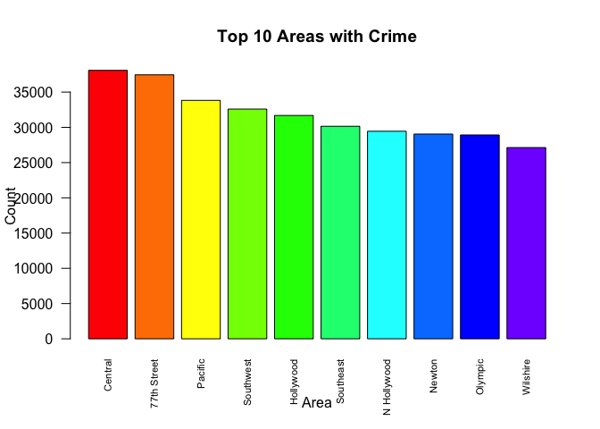
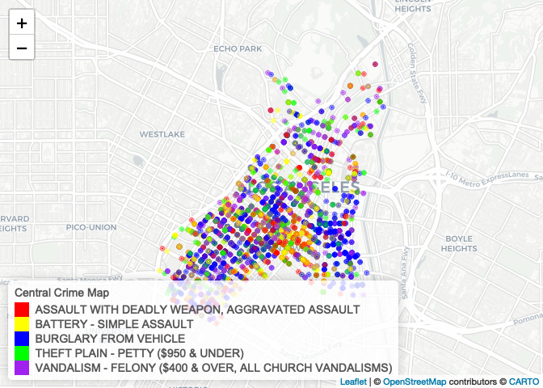
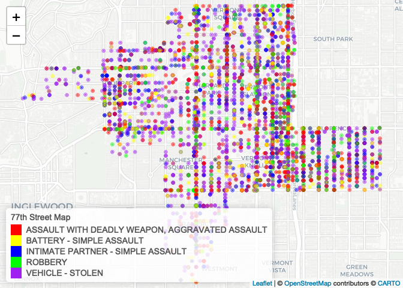
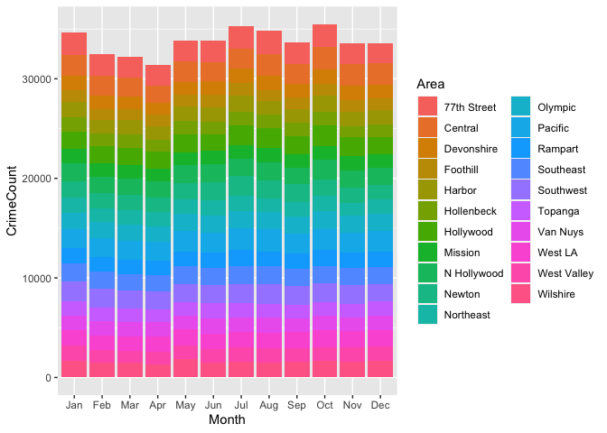
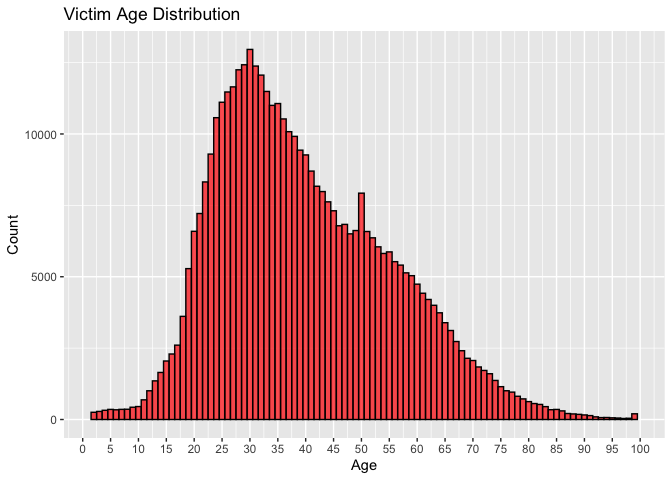
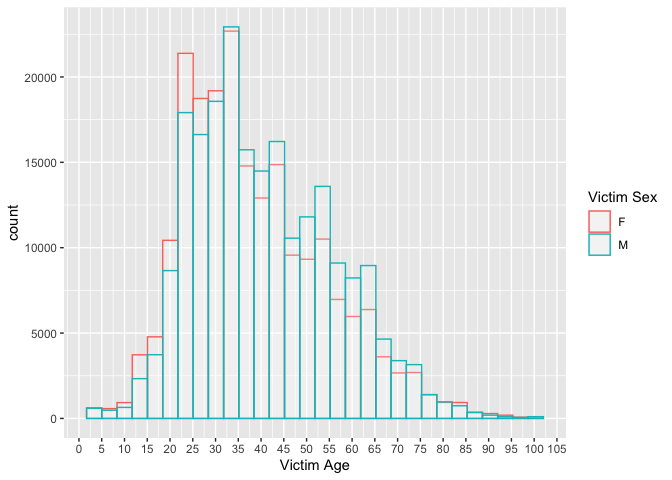
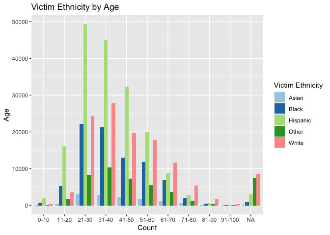

pm566-midterm-final
================
Misha Khan
2022-10-24

``` r
library(stringr)
library(dplyr)
```

    ## 
    ## Attaching package: 'dplyr'

    ## The following objects are masked from 'package:stats':
    ## 
    ##     filter, lag

    ## The following objects are masked from 'package:base':
    ## 
    ##     intersect, setdiff, setequal, union

``` r
library(tidyverse)
```

    ## ── Attaching packages
    ## ───────────────────────────────────────
    ## tidyverse 1.3.2 ──

    ## ✔ ggplot2 3.3.6     ✔ readr   2.1.2
    ## ✔ tibble  3.1.8     ✔ purrr   0.3.4
    ## ✔ tidyr   1.2.1     ✔ forcats 0.5.2
    ## ── Conflicts ────────────────────────────────────────── tidyverse_conflicts() ──
    ## ✖ dplyr::filter() masks stats::filter()
    ## ✖ dplyr::lag()    masks stats::lag()

``` r
library(rvest)
```

    ## 
    ## Attaching package: 'rvest'
    ## 
    ## The following object is masked from 'package:readr':
    ## 
    ##     guess_encoding

``` r
library(xml2)
library(dbplyr)
```

    ## 
    ## Attaching package: 'dbplyr'
    ## 
    ## The following objects are masked from 'package:dplyr':
    ## 
    ##     ident, sql

``` r
library(dplyr)
library(skimr) 
library(ggplot2)
library(data.table)
```

    ## 
    ## Attaching package: 'data.table'
    ## 
    ## The following object is masked from 'package:purrr':
    ## 
    ##     transpose
    ## 
    ## The following objects are masked from 'package:dplyr':
    ## 
    ##     between, first, last

``` r
library(lubridate)
```

    ## 
    ## Attaching package: 'lubridate'
    ## 
    ## The following objects are masked from 'package:data.table':
    ## 
    ##     hour, isoweek, mday, minute, month, quarter, second, wday, week,
    ##     yday, year
    ## 
    ## The following objects are masked from 'package:base':
    ## 
    ##     date, intersect, setdiff, union

``` r
library(leaflet)
library(webshot)
library(rapportools)
```

    ## 
    ## Attaching package: 'rapportools'
    ## 
    ## The following object is masked from 'package:dplyr':
    ## 
    ##     n
    ## 
    ## The following objects are masked from 'package:stats':
    ## 
    ##     IQR, median, sd, var
    ## 
    ## The following objects are masked from 'package:base':
    ## 
    ##     max, mean, min, range, sum

``` r
library(lubridate)
library(dtplyr)
```

# Midterm 566 Fall 2022

### Topic: Crime Data from 2020 to Present in Los Angeles

Source URL:
<https://data.lacity.org/Public-Safety/Crime-Data-from-2020-to-Present/2nrs-mtv8>

``` r
crimeraw <- read.csv("Crime_Data_from_2020_to_Present.csv")
```

The original dataset, crimeraw, has 586,295 observations and 19
variables that describe date, time, crime, victim’s demographics, and
location. My main research question is whichs areas of Los Angeles has
the highest crime. In this report, I’ll be taking a closer look at the
proportion of crime per area, most common crimes committed in certain
areas, and victim demographic breakdown.

#### Data Cleaning

``` r
#Rename the columns to be more descriptive
colnames(crimeraw) <- c('Record No',
                        'Date Reported',
                        'Date Occurred',
                        'Time Occurred',
                        'Area No',
                        'Area',
                        'Rpt Dist No', 
                        'Part', 
                        'Crime Code',
                        'Crime',
                        'MO', 
                        'Victim Age',
                        'Victim Sex',
                        'Victim Ethnicity',
                        'Premise Code',
                        'Premise', 
                        'Weapon Code',
                        'Weapon',
                        'Case Code',
                        'Case Status',
                        'Crime Code 1',
                        'Crime Code 2',
                        'Crime Code 3',
                        'Crime Code 4',
                        'Location',
                        'Cross Street',
                        'Lat',
                        'Lon'
                        )

#Drop unwanted columns
crimeraw <- select(crimeraw, -c('Rpt Dist No','Part', 'MO','Premise', 'Crime Code 1', 'Crime Code 2', 'Crime Code 3', 'Crime Code 4', 'Cross Street'))
```

``` r
#Reformat date variables
crimeraw$`Date Reported` <- as.Date(crimeraw$`Date Reported`, format = "%m/%d/%Y")
crimeraw$`Date Occurred` <- as.Date(crimeraw$`Date Occurred`, format = "%m/%d/%Y")

#Change miltary to standard time
crimeraw$`Time Occurred` <- format(strptime(substr(as.POSIXct(sprintf("%04.0f", crimeraw$`Time Occurred`), 
                                 format="%H%M"), 12, 16), '%H:%M'), '%I:%M %p')
```

``` r
#Create Month & Year column for later analysis
crimeraw$Month = format(crimeraw$`Date Occurred`, "%b")
crimeraw$Year = format(crimeraw$`Date Occurred`, "%Y")
```

``` r
#Drop (0,0) coordinates
sum(crimeraw$Lat == 0)
```

    ## [1] 2266

``` r
sum(crimeraw$Lon == 0)
```

    ## [1] 2266

``` r
crimeraw <- subset(crimeraw, Lat != 0, Lon != 0)
```

There are 2,266 coordinates that are (0,0) due to privacy reasons. For
simplicity, I dropped these values since it is not a lot of rows that
will affect analysis.

``` r
#Examine Victim Age
summary(crimeraw$`Victim Age`)
```

    ##    Min. 1st Qu.  Median    Mean 3rd Qu.    Max. 
    ##   -1.00   12.00   31.00   29.97   45.00  120.00

``` r
crimeraw <-
  crimeraw %>%
  filter(`Victim Age` >= 0 & `Victim Age` <= 100)
```

Victim Age has negative values, 0’s (meaning is not available), and an
oddly high value (120). To generalize age, I filtered the values from
0-100, excluding the negative values. This step discarded 25 rows making
crimeraw now 584,004 rows.

``` r
#Replace empty cells with NA values
crimeraw$Weapon[is.empty(crimeraw$Weapon)] <- "NONE"
crimeraw$`Victim Sex`[is.empty(crimeraw$`Victim Sex`)] <- NA
crimeraw$`Victim Ethnicity`[is.empty(crimeraw$`Victim Ethnicity`)] <- NA
crimeraw$`Victim Age`[crimeraw$`Victim Age` == 0] <- NA
```

Weapon has 376,955 empty cells, Victim Sex has 77,497 empty cells, and
Victim Ethnicity has 77,502 empty cells. I decided to replace the empty
cells with NA since there is a lot of observations that are missing that
can be crucial for analysis. I assumed empty cells for Weapon means no
weapon was used.

``` r
#Replace missing cells in Weapon Code with 999 to signify no weapon
crimeraw$`Weapon Code` <- crimeraw$`Weapon Code` %>% replace_na(999)
```

I used 999 to signify there was no weapon used instead of NA.

The dataset crimeraw is now 584,004 observations and 21 variables. This
process removed 2,291 rows.

After I cleaned the data, I saved it as an .rds file.

``` r
#Save as changes as a new file
#write_rds(crimeraw, "crimedatfinal.rds")
crimedat <- read_rds("crimedatfinal.rds")
crimecopy <- crimedat #make a copy for reference
crimedat <- as.data.frame(crimedat)
```

#### EDA

##### EDA \#1: What is the amount of crime per area in LA from 2020-2022?

``` r
#Calculate proportion of crime per area
crime_frequency <-count(crimedat, Area)
nc <- sum(crime_frequency$n)

crime_frequency %>% 
  arrange(desc(n)) %>%
  mutate(Percent = round( n / nc * 100, 2))  %>%
knitr::kable()
```

| Area        |     n | Percent |
|:------------|------:|--------:|
| Central     | 38087 |    6.52 |
| 77th Street | 37451 |    6.41 |
| Pacific     | 33829 |    5.79 |
| Southwest   | 32594 |    5.58 |
| Hollywood   | 31688 |    5.43 |
| Southeast   | 30156 |    5.16 |
| N Hollywood | 29448 |    5.04 |
| Newton      | 29050 |    4.97 |
| Olympic     | 28922 |    4.95 |
| Wilshire    | 27134 |    4.65 |
| Rampart     | 26998 |    4.62 |
| West LA     | 26942 |    4.61 |
| Northeast   | 25486 |    4.36 |
| Harbor      | 24724 |    4.23 |
| Van Nuys    | 24615 |    4.21 |
| West Valley | 24240 |    4.15 |
| Topanga     | 23713 |    4.06 |
| Mission     | 23642 |    4.05 |
| Devonshire  | 22994 |    3.94 |
| Hollenbeck  | 22280 |    3.82 |
| Foothill    | 20011 |    3.43 |

Central area has the highest proportion of crime of 6.52% (38,087
reported crimes since 2020). Next is 77th Street with 6.41% (37,451
reports) then Pacific with 5.79% (33,829 reports).

I focused on the top 10 crime areas in LA.

``` r
v1 <- table(crimedat$`Area`)
barplot(sort(v1, T)[1:10], las = 2, col = rainbow(12), cex.names= .7, main = "Top 10 Areas with Crime", xlab = "Area", ylab = "Count")
```

<!-- -->
There is Central and 77th Street and noticeably higher in crime compared
to the rest of the areas. There is a 3,622 difference in reports
comparing 77th Street and Pacific.

##### EDA \#2: What is the top 5 most crimes in Central and 77th Street in 2021?

**Central**

``` r
detach(package:dplyr)
library(dplyr)
```

    ## 
    ## Attaching package: 'dplyr'

    ## The following object is masked from 'package:rapportools':
    ## 
    ##     n

    ## The following objects are masked from 'package:data.table':
    ## 
    ##     between, first, last

    ## The following objects are masked from 'package:dbplyr':
    ## 
    ##     ident, sql

    ## The following objects are masked from 'package:stats':
    ## 
    ##     filter, lag

    ## The following objects are masked from 'package:base':
    ## 
    ##     intersect, setdiff, setequal, union

``` r
#Creating a new df to subset for Central
central_top_crimes <-
  crimedat %>%
  select(`Record No`, `Crime Code`, Area, Crime, `Year`, `Lat`, `Lon`)

#Subset Area = Central and Year = 2021
central_top_crimes <- subset(central_top_crimes, 
                          `Area` %in% c("Central") &
                          `Year` %in% c("2021"))

#View top 5 crimes in Central
central_top_crimes %>% 
  group_by(Area, `Crime Code`, Crime) %>%
  summarise(Count = n()) %>%
  arrange(desc(Count)) %>%
  knitr::kable()
```

    ## `summarise()` has grouped output by 'Area', 'Crime Code'. You can override
    ## using the `.groups` argument.

| Area    | Crime Code | Crime                                                     | Count |
|:--------|-----------:|:----------------------------------------------------------|------:|
| Central |        330 | BURGLARY FROM VEHICLE                                     |  1660 |
| Central |        624 | BATTERY - SIMPLE ASSAULT                                  |  1404 |
| Central |        740 | VANDALISM - FELONY (\$400 & OVER, ALL CHURCH VANDALISMS)  |  1008 |
| Central |        230 | ASSAULT WITH DEADLY WEAPON, AGGRAVATED ASSAULT            |   914 |
| Central |        440 | THEFT PLAIN - PETTY (\$950 & UNDER)                       |   895 |
| Central |        510 | VEHICLE - STOLEN                                          |   834 |
| Central |        210 | ROBBERY                                                   |   676 |
| Central |        341 | THEFT-GRAND (\$950.01 & OVER)EXCPT,GUNS,FOWL,LIVESTK,PROD |   559 |
| Central |        310 | BURGLARY                                                  |   516 |
| Central |        626 | INTIMATE PARTNER - SIMPLE ASSAULT                         |   506 |
| Central |        745 | VANDALISM - MISDEAMEANOR (\$399 OR UNDER)                 |   330 |
| Central |        354 | THEFT OF IDENTITY                                         |   301 |
| Central |        331 | THEFT FROM MOTOR VEHICLE - GRAND (\$950.01 AND OVER)      |   279 |
| Central |        480 | BIKE - STOLEN                                             |   275 |
| Central |        761 | BRANDISH WEAPON                                           |   267 |
| Central |        420 | THEFT FROM MOTOR VEHICLE - PETTY (\$950 & UNDER)          |   253 |
| Central |        930 | CRIMINAL THREATS - NO WEAPON DISPLAYED                    |   232 |
| Central |        236 | INTIMATE PARTNER - AGGRAVATED ASSAULT                     |   177 |
| Central |        888 | TRESPASSING                                               |   176 |
| Central |        442 | SHOPLIFTING - PETTY THEFT (\$950 & UNDER)                 |   158 |
| Central |        350 | THEFT, PERSON                                             |   138 |
| Central |        625 | OTHER ASSAULT                                             |   138 |
| Central |        220 | ATTEMPTED ROBBERY                                         |   130 |
| Central |        121 | RAPE, FORCIBLE                                            |    97 |
| Central |        956 | LETTERS, LEWD - TELEPHONE CALLS, LEWD                     |    81 |
| Central |        946 | OTHER MISCELLANEOUS CRIME                                 |    80 |
| Central |        860 | BATTERY WITH SEXUAL CONTACT                               |    72 |
| Central |        623 | BATTERY POLICE (SIMPLE)                                   |    65 |
| Central |        901 | VIOLATION OF RESTRAINING ORDER                            |    64 |
| Central |        668 | EMBEZZLEMENT, GRAND THEFT (\$950.01 & OVER)               |    51 |
| Central |        648 | ARSON                                                     |    50 |
| Central |        662 | BUNCO, GRAND THEFT                                        |    39 |
| Central |        845 | SEX OFFENDER REGISTRANT OUT OF COMPLIANCE                 |    31 |
| Central |        900 | VIOLATION OF COURT ORDER                                  |    31 |
| Central |        352 | PICKPOCKET                                                |    30 |
| Central |        664 | BUNCO, PETTY THEFT                                        |    26 |
| Central |        110 | CRIMINAL HOMICIDE                                         |    25 |
| Central |        437 | RESISTING ARREST                                          |    24 |
| Central |        320 | BURGLARY, ATTEMPTED                                       |    22 |
| Central |        850 | INDECENT EXPOSURE                                         |    20 |
| Central |        343 | SHOPLIFTING-GRAND THEFT (\$950.01 & OVER)                 |    19 |
| Central |        753 | DISCHARGE FIREARMS/SHOTS FIRED                            |    19 |
| Central |        815 | SEXUAL PENETRATION W/FOREIGN OBJECT                       |    18 |
| Central |        820 | ORAL COPULATION                                           |    18 |
| Central |        231 | ASSAULT WITH DEADLY WEAPON ON POLICE OFFICER              |    17 |
| Central |        755 | BOMB SCARE                                                |    16 |
| Central |        520 | VEHICLE - ATTEMPT STOLEN                                  |    14 |
| Central |        622 | BATTERY ON A FIREFIGHTER                                  |    14 |
| Central |        649 | DOCUMENT FORGERY / STOLEN FELONY                          |    14 |
| Central |        762 | LEWD CONDUCT                                              |    13 |
| Central |        890 | FAILURE TO YIELD                                          |    13 |
| Central |        450 | THEFT FROM PERSON - ATTEMPT                               |    10 |
| Central |        910 | KIDNAPPING                                                |    10 |
| Central |        237 | CHILD NEGLECT (SEE 300 W.I.C.)                            |     9 |
| Central |        434 | FALSE IMPRISONMENT                                        |     9 |
| Central |        821 | SODOMY/SEXUAL CONTACT B/W PENIS OF ONE PERS TO ANUS OTH   |     9 |
| Central |        441 | THEFT PLAIN - ATTEMPT                                     |     8 |
| Central |        886 | DISTURBING THE PEACE                                      |     8 |
| Central |        940 | EXTORTION                                                 |     8 |
| Central |        251 | SHOTS FIRED AT INHABITED DWELLING                         |     7 |
| Central |        410 | BURGLARY FROM VEHICLE, ATTEMPTED                          |     7 |
| Central |        522 | VEHICLE - MOTORIZED SCOOTERS, BICYCLES, AND WHEELCHAIRS   |     7 |
| Central |        903 | CONTEMPT OF COURT                                         |     7 |
| Central |        627 | CHILD ABUSE (PHYSICAL) - SIMPLE ASSAULT                   |     5 |
| Central |        951 | DEFRAUDING INNKEEPER/THEFT OF SERVICES, \$950 & UNDER     |     5 |
| Central |        250 | SHOTS FIRED AT MOVING VEHICLE, TRAIN OR AIRCRAFT          |     4 |
| Central |        647 | THROWING OBJECT AT MOVING VEHICLE                         |     4 |
| Central |        813 | CHILD ANNOYING (17YRS & UNDER)                            |     4 |
| Central |        920 | KIDNAPPING - GRAND ATTEMPT                                |     4 |
| Central |        122 | RAPE, ATTEMPTED                                           |     3 |
| Central |        421 | THEFT FROM MOTOR VEHICLE - ATTEMPT                        |     3 |
| Central |        438 | RECKLESS DRIVING                                          |     3 |
| Central |        661 | UNAUTHORIZED COMPUTER ACCESS                              |     3 |
| Central |        763 | STALKING                                                  |     3 |
| Central |        810 | SEX,UNLAWFUL(INC MUTUAL CONSENT, PENETRATION W/ FRGN OBJ  |     3 |
| Central |        433 | DRIVING WITHOUT OWNER CONSENT (DWOC)                      |     2 |
| Central |        660 | COUNTERFEIT                                               |     2 |
| Central |        670 | EMBEZZLEMENT, PETTY THEFT (\$950 & UNDER)                 |     2 |
| Central |        921 | HUMAN TRAFFICKING - INVOLUNTARY SERVITUDE                 |     2 |
| Central |        928 | THREATENING PHONE CALLS/LETTERS                           |     2 |
| Central |        943 | CRUELTY TO ANIMALS                                        |     2 |
| Central |        235 | CHILD ABUSE (PHYSICAL) - AGGRAVATED ASSAULT               |     1 |
| Central |        351 | PURSE SNATCHING                                           |     1 |
| Central |        353 | DRUNK ROLL                                                |     1 |
| Central |        439 | FALSE POLICE REPORT                                       |     1 |
| Central |        451 | PURSE SNATCHING - ATTEMPT                                 |     1 |
| Central |        452 | PICKPOCKET, ATTEMPT                                       |     1 |
| Central |        471 | TILL TAP - PETTY (\$950 & UNDER)                          |     1 |
| Central |        651 | DOCUMENT WORTHLESS (\$200.01 & OVER)                      |     1 |
| Central |        756 | WEAPONS POSSESSION/BOMBING                                |     1 |
| Central |        760 | LEWD/LASCIVIOUS ACTS WITH CHILD                           |     1 |
| Central |        812 | CRM AGNST CHLD (13 OR UNDER) (14-15 & SUSP 10 YRS OLDER)  |     1 |
| Central |        814 | CHILD PORNOGRAPHY                                         |     1 |
| Central |        840 | BEASTIALITY, CRIME AGAINST NATURE SEXUAL ASSLT WITH ANIM  |     1 |
| Central |        902 | VIOLATION OF TEMPORARY RESTRAINING ORDER                  |     1 |
| Central |        904 | FIREARMS EMERGENCY PROTECTIVE ORDER (FIREARMS EPO)        |     1 |
| Central |        932 | PEEPING TOM                                               |     1 |
| Central |        944 | CONSPIRACY                                                |     1 |
| Central |        949 | ILLEGAL DUMPING                                           |     1 |

The top 5 crimes in Central area are: Burglary from Vehicle - 1,660
reports, Battery (Simple Assault) - 1,404 reports, Vandalism - 1,008
reports, Assault with Weapon - 914 reports, and Theft - 895 reports.

``` r
#Now subset Crime Code to top 5 in that area
central_top_crimes <- subset(central_top_crimes, 
                          `Crime Code` %in% c("330", "624", "740", "230", "440"))
```

Originally, there were 12,982 rows for Central in 2021 meaning there
were 12,982 reports. The top 5 crimes shortens the data to 5,881
rows/reports.

Creating Central Map

``` r
#Map color palette
central.pal <- colorFactor(c('red', 'yellow', 'blue', 'green', 'purple'), domain = central_top_crimes$`Crime`)

central_map <- 
  leaflet(central_top_crimes) %>%  
  addProviderTiles('CartoDB.Positron') %>% 
  addCircles(
    lat = ~Lat, 
    lng = ~Lon,
    label = ~paste0(central_top_crimes$`Crime`),
    color = ~ central.pal(central_top_crimes$`Crime`),
    opacity = 0.5,
    fillOpacity = 1,
    radius = 5
    ) %>%
  addLegend('bottomleft', 
            pal = central.pal,  
            values = central_top_crimes$`Crime`,
            title = 'Central Crime Map', 
            opacity = 1)
central_map
```

<!-- -->
This is a map of top 5 crimes in Central area. There is a noticeable
amount of blue dots which is the top reported crime, burglary from
vehicle.

**77th Street**

``` r
#Creating a new df to subset for 77th Street
st77_top_crimes  <-
  crimedat %>%
  select(`Record No`, `Crime Code`, Area, Crime, `Year`, `Lat`, `Lon`)

#Subset Area = 77th Street and Year = 2021
st77_top_crimes <- subset(st77_top_crimes, 
                          `Area` %in% c("77th Street") &
                          `Year` %in% c("2021"))

#View top 5 crimes in Central
st77_top_crimes %>% 
  group_by(Area, `Crime Code`, Crime) %>%
  summarise(Count = n()) %>%
  arrange(desc(Count)) %>%
  knitr::kable()
```

    ## `summarise()` has grouped output by 'Area', 'Crime Code'. You can override
    ## using the `.groups` argument.

| Area        | Crime Code | Crime                                                     | Count |
|:------------|-----------:|:----------------------------------------------------------|------:|
| 77th Street |        510 | VEHICLE - STOLEN                                          |  1765 |
| 77th Street |        230 | ASSAULT WITH DEADLY WEAPON, AGGRAVATED ASSAULT            |  1331 |
| 77th Street |        624 | BATTERY - SIMPLE ASSAULT                                  |  1001 |
| 77th Street |        626 | INTIMATE PARTNER - SIMPLE ASSAULT                         |   905 |
| 77th Street |        210 | ROBBERY                                                   |   841 |
| 77th Street |        740 | VANDALISM - FELONY (\$400 & OVER, ALL CHURCH VANDALISMS)  |   772 |
| 77th Street |        310 | BURGLARY                                                  |   512 |
| 77th Street |        354 | THEFT OF IDENTITY                                         |   493 |
| 77th Street |        745 | VANDALISM - MISDEAMEANOR (\$399 OR UNDER)                 |   461 |
| 77th Street |        440 | THEFT PLAIN - PETTY (\$950 & UNDER)                       |   415 |
| 77th Street |        236 | INTIMATE PARTNER - AGGRAVATED ASSAULT                     |   389 |
| 77th Street |        330 | BURGLARY FROM VEHICLE                                     |   379 |
| 77th Street |        930 | CRIMINAL THREATS - NO WEAPON DISPLAYED                    |   352 |
| 77th Street |        761 | BRANDISH WEAPON                                           |   351 |
| 77th Street |        420 | THEFT FROM MOTOR VEHICLE - PETTY (\$950 & UNDER)          |   334 |
| 77th Street |        903 | CONTEMPT OF COURT                                         |   228 |
| 77th Street |        341 | THEFT-GRAND (\$950.01 & OVER)EXCPT,GUNS,FOWL,LIVESTK,PROD |   220 |
| 77th Street |        331 | THEFT FROM MOTOR VEHICLE - GRAND (\$950.01 AND OVER)      |   205 |
| 77th Street |        946 | OTHER MISCELLANEOUS CRIME                                 |   132 |
| 77th Street |        220 | ATTEMPTED ROBBERY                                         |   118 |
| 77th Street |        901 | VIOLATION OF RESTRAINING ORDER                            |   114 |
| 77th Street |        350 | THEFT, PERSON                                             |    92 |
| 77th Street |        753 | DISCHARGE FIREARMS/SHOTS FIRED                            |    87 |
| 77th Street |        121 | RAPE, FORCIBLE                                            |    86 |
| 77th Street |        251 | SHOTS FIRED AT INHABITED DWELLING                         |    76 |
| 77th Street |        623 | BATTERY POLICE (SIMPLE)                                   |    76 |
| 77th Street |        956 | LETTERS, LEWD - TELEPHONE CALLS, LEWD                     |    68 |
| 77th Street |        110 | CRIMINAL HOMICIDE                                         |    63 |
| 77th Street |        648 | ARSON                                                     |    63 |
| 77th Street |        888 | TRESPASSING                                               |    55 |
| 77th Street |        900 | VIOLATION OF COURT ORDER                                  |    51 |
| 77th Street |        627 | CHILD ABUSE (PHYSICAL) - SIMPLE ASSAULT                   |    47 |
| 77th Street |        812 | CRM AGNST CHLD (13 OR UNDER) (14-15 & SUSP 10 YRS OLDER)  |    47 |
| 77th Street |        822 | HUMAN TRAFFICKING - COMMERCIAL SEX ACTS                   |    47 |
| 77th Street |        662 | BUNCO, GRAND THEFT                                        |    46 |
| 77th Street |        320 | BURGLARY, ATTEMPTED                                       |    45 |
| 77th Street |        520 | VEHICLE - ATTEMPT STOLEN                                  |    43 |
| 77th Street |        625 | OTHER ASSAULT                                             |    43 |
| 77th Street |        250 | SHOTS FIRED AT MOVING VEHICLE, TRAIN OR AIRCRAFT          |    39 |
| 77th Street |        442 | SHOPLIFTING - PETTY THEFT (\$950 & UNDER)                 |    39 |
| 77th Street |        860 | BATTERY WITH SEXUAL CONTACT                               |    26 |
| 77th Street |        910 | KIDNAPPING                                                |    24 |
| 77th Street |        890 | FAILURE TO YIELD                                          |    22 |
| 77th Street |        231 | ASSAULT WITH DEADLY WEAPON ON POLICE OFFICER              |    21 |
| 77th Street |        437 | RESISTING ARREST                                          |    21 |
| 77th Street |        237 | CHILD NEGLECT (SEE 300 W.I.C.)                            |    20 |
| 77th Street |        805 | PIMPING                                                   |    20 |
| 77th Street |        649 | DOCUMENT FORGERY / STOLEN FELONY                          |    18 |
| 77th Street |        820 | ORAL COPULATION                                           |    16 |
| 77th Street |        921 | HUMAN TRAFFICKING - INVOLUNTARY SERVITUDE                 |    16 |
| 77th Street |        421 | THEFT FROM MOTOR VEHICLE - ATTEMPT                        |    15 |
| 77th Street |        763 | STALKING                                                  |    15 |
| 77th Street |        664 | BUNCO, PETTY THEFT                                        |    14 |
| 77th Street |        922 | CHILD STEALING                                            |    14 |
| 77th Street |        235 | CHILD ABUSE (PHYSICAL) - AGGRAVATED ASSAULT               |    13 |
| 77th Street |        666 | BUNCO, ATTEMPT                                            |    13 |
| 77th Street |        815 | SEXUAL PENETRATION W/FOREIGN OBJECT                       |    13 |
| 77th Street |        668 | EMBEZZLEMENT, GRAND THEFT (\$950.01 & OVER)               |    11 |
| 77th Street |        810 | SEX,UNLAWFUL(INC MUTUAL CONSENT, PENETRATION W/ FRGN OBJ  |    11 |
| 77th Street |        940 | EXTORTION                                                 |    10 |
| 77th Street |        410 | BURGLARY FROM VEHICLE, ATTEMPTED                          |     9 |
| 77th Street |        813 | CHILD ANNOYING (17YRS & UNDER)                            |     9 |
| 77th Street |        928 | THREATENING PHONE CALLS/LETTERS                           |     9 |
| 77th Street |        943 | CRUELTY TO ANIMALS                                        |     9 |
| 77th Street |        845 | SEX OFFENDER REGISTRANT OUT OF COMPLIANCE                 |     8 |
| 77th Street |        920 | KIDNAPPING - GRAND ATTEMPT                                |     8 |
| 77th Street |        821 | SODOMY/SEXUAL CONTACT B/W PENIS OF ONE PERS TO ANUS OTH   |     7 |
| 77th Street |        886 | DISTURBING THE PEACE                                      |     7 |
| 77th Street |        122 | RAPE, ATTEMPTED                                           |     6 |
| 77th Street |        480 | BIKE - STOLEN                                             |     6 |
| 77th Street |        647 | THROWING OBJECT AT MOVING VEHICLE                         |     6 |
| 77th Street |        762 | LEWD CONDUCT                                              |     6 |
| 77th Street |        814 | CHILD PORNOGRAPHY                                         |     6 |
| 77th Street |        850 | INDECENT EXPOSURE                                         |     6 |
| 77th Street |        441 | THEFT PLAIN - ATTEMPT                                     |     5 |
| 77th Street |        622 | BATTERY ON A FIREFIGHTER                                  |     4 |
| 77th Street |        932 | PEEPING TOM                                               |     4 |
| 77th Street |        351 | PURSE SNATCHING                                           |     3 |
| 77th Street |        487 | BOAT - STOLEN                                             |     3 |
| 77th Street |        755 | BOMB SCARE                                                |     3 |
| 77th Street |        806 | PANDERING                                                 |     3 |
| 77th Street |        902 | VIOLATION OF TEMPORARY RESTRAINING ORDER                  |     3 |
| 77th Street |        343 | SHOPLIFTING-GRAND THEFT (\$950.01 & OVER)                 |     2 |
| 77th Street |        434 | FALSE IMPRISONMENT                                        |     2 |
| 77th Street |        438 | RECKLESS DRIVING                                          |     2 |
| 77th Street |        443 | SHOPLIFTING - ATTEMPT                                     |     2 |
| 77th Street |        450 | THEFT FROM PERSON - ATTEMPT                               |     2 |
| 77th Street |        653 | CREDIT CARDS, FRAUD USE (\$950.01 & OVER)                 |     2 |
| 77th Street |        880 | DISRUPT SCHOOL                                            |     2 |
| 77th Street |        439 | FALSE POLICE REPORT                                       |     1 |
| 77th Street |        444 | DISHONEST EMPLOYEE - PETTY THEFT                          |     1 |
| 77th Street |        471 | TILL TAP - PETTY (\$950 & UNDER)                          |     1 |
| 77th Street |        522 | VEHICLE - MOTORIZED SCOOTERS, BICYCLES, AND WHEELCHAIRS   |     1 |
| 77th Street |        654 | CREDIT CARDS, FRAUD USE (\$950 & UNDER                    |     1 |
| 77th Street |        661 | UNAUTHORIZED COMPUTER ACCESS                              |     1 |
| 77th Street |        670 | EMBEZZLEMENT, PETTY THEFT (\$950 & UNDER)                 |     1 |
| 77th Street |        760 | LEWD/LASCIVIOUS ACTS WITH CHILD                           |     1 |
| 77th Street |        870 | CHILD ABANDONMENT                                         |     1 |
| 77th Street |        931 | REPLICA FIREARMS(SALE,DISPLAY,MANUFACTURE OR DISTRIBUTE)  |     1 |
| 77th Street |        933 | PROWLER                                                   |     1 |
| 77th Street |        949 | ILLEGAL DUMPING                                           |     1 |

The top 5 crimes in 77th Street area are: Stolen Vehicle- 1,765 reports,
Assault by Deadly Weapon - 1,331 reports, Battery - 1,001 reports,
Domestic Partner Assault - 905 reports, and Robbery - 841 reports.

``` r
#Now subset Crime Code to top 5 in that area
st77_top_crimes <- subset(st77_top_crimes, 
                          `Crime Code` %in% c("510", "230", "624", "626", "210"))
```

Originally, there were 12,920 rows for 77th Street in 2021 meaning there
were 12,920 reports. The top 5 crimes shortens the data to 5,843
rows/reports.

Creating 77th Street Map

``` r
st77.pal <- colorFactor(c('red', 'yellow', 'blue', 'green', 'purple'), domain = st77_top_crimes$`Crime`)

st77_map <- 
  leaflet(st77_top_crimes) %>%  
  addProviderTiles('CartoDB.Positron') %>% 
  addCircles(
    lat = ~Lat, 
    lng = ~Lon,
    label = ~paste0(st77_top_crimes$`Crime`),
    color = ~ st77.pal(st77_top_crimes$`Crime`),
    opacity = 0.5,
    fillOpacity = 1,
    radius = 5
    ) %>%
  addLegend('bottomleft', 
            pal = st77.pal,  
            values = st77_top_crimes$`Crime`,
            title = '77th Street Map', 
            opacity = 1)
st77_map
```

<!-- -->
This is a map of top 5 crimes in 77th Street area. There is a noticeable
amount of purple dots which is the top reported crime, vehicle stolen.

##### EDA \#3: Which month had the highest crime?

``` r
#detach(package:dplyr)
#library(dplyr)
crime_count_month <-  
  crimedat %>%
  group_by(Month, Year, Area) %>% 
  summarize(CrimeCount = n()) 
```

    ## `summarise()` has grouped output by 'Month', 'Year'. You can override using the
    ## `.groups` argument.

``` r
crime_count_month <- subset(crime_count_month, 
                            Year %in% c("2020", "2021")) #2022 is still in progress

#Order months in order for graph
month.ordered <- 
  crime_count_month %>%
  mutate(Month = factor(Month, levels = c("Jan", "Feb", "Mar", "Apr", "May",  "Jun", "Jul", "Aug", "Sep", "Oct", "Nov", "Dec")))

month.ordered  %>%
ggplot(aes(x = Month, y = CrimeCount, fill = Area)) +
  geom_bar(stat = "identity")
```

<!-- -->
Since 2022 is still in progress, it is removed for this visualization.
From 2020-2021, here is the number of reports per month. The cooler
months (Feb - Apr) have a slightly lower number of reports while the
warmer months (May - Aug) have a higher number of reports.

##### EDA \#4: What is the breakdown of the victim’s age? Victim’s sex? Victim’s ethncity?

``` r
#Create df
victim_demographics <-
  crimedat %>%
  select(`Record No`, `Crime Code`,`Victim Age`, `Victim Sex`, `Victim Ethnicity` , Area, Crime, `Year`)

#For simplicity
victim_demographics <- subset(victim_demographics, 
                          `Victim Sex` %in% c("F", "M") &
                          `Victim Ethnicity`  %in% c("B", "H", "W", "A", "O"))
```

For simplicity, I removed extra unique values in victim sex and
ethnicity (140,054 removed), leaving 443,950 observations for analysis.

**Victim Age**

``` r
victim_demographics %>%
  ggplot(mapping = aes(x = `Victim Age`)) + 
  geom_histogram(position = "identity", alpha = 0.7, binwidth = 1, color = "black", fill = "red") +
  scale_x_continuous(breaks = scales::pretty_breaks(n = 20)) +
  ggtitle("Victim Age Distribution") +
  xlab("Age") +
  ylab("Count")
```

    ## Warning: Removed 20152 rows containing non-finite values (stat_bin).

<!-- -->
The histogram shows the average victim age from 2020-2022 is around 30
with a spike at 35 and 50.

**Victim Sex**

``` r
 victim_demographics %>%
 ggplot(aes(x=`Victim Age`, color= `Victim Sex`)) +
geom_histogram(fill="white", alpha=0.2, position="identity") +
scale_x_continuous(breaks = scales::pretty_breaks(n = 20)) 
```

    ## `stat_bin()` using `bins = 30`. Pick better value with `binwidth`.

    ## Warning: Removed 20152 rows containing non-finite values (stat_bin).

<!-- -->

Here is a closer breakdown of victim age by victim sex. There is a
noticeable spike in younger women reporting crimes (around mid 20s)
while there is a spike in men in their 30s.

**Victim Ethnicity**

``` r
victim_demographics <-
  victim_demographics %>%
  mutate(victim_ethnicity_f = case_when(victim_demographics$`Victim Ethnicity` == "W" ~ "White",
                                        victim_demographics$`Victim Ethnicity` == "B" ~ "Black",
                                        victim_demographics$`Victim Ethnicity` == "A" ~ "Asian",
                                        victim_demographics$`Victim Ethnicity` == "H" ~ "Hispanic",
                                        victim_demographics$`Victim Ethnicity` == "O" ~ "Other"))

victim_demographics <-
  victim_demographics %>%
  mutate(victim_age_f = 
           case_when(victim_demographics$`Victim Age` >= 0 & victim_demographics$`Victim Age`<= 10 ~ "0-10",
                     victim_demographics$`Victim Age` >= 11 & victim_demographics$`Victim Age`<= 20 ~ "11-20",
                     victim_demographics$`Victim Age` >= 21 & victim_demographics$`Victim Age`<= 30 ~ "21-30",
                     victim_demographics$`Victim Age` >= 31 & victim_demographics$`Victim Age`<= 40 ~ "31-40",
                     victim_demographics$`Victim Age` >= 41 & victim_demographics$`Victim Age`<= 50 ~ "41-50",
                     victim_demographics$`Victim Age` >= 51 & victim_demographics$`Victim Age`<= 60 ~ "51-60",
                     victim_demographics$`Victim Age` >= 61 & victim_demographics$`Victim Age`<= 70 ~ "61-70",
                     victim_demographics$`Victim Age` >= 71 & victim_demographics$`Victim Age`<= 80 ~ "71-80",
                     victim_demographics$`Victim Age` >= 81 & victim_demographics$`Victim Age`<= 90 ~ "81-90",
                  victim_demographics$`Victim Age` >= 91 & victim_demographics$`Victim Age`<= 100 ~ "91-100"))
```

``` r
victim_demographics %>%
  ggplot(mapping = aes(x = victim_age_f, fill = factor(victim_ethnicity_f))) + 
  geom_bar(position = "dodge") +
  scale_fill_brewer(palette = "Paired") +
  ggtitle("Victim Ethnicity by Age") +
  xlab("Count") +
  ylab("Age") +
  labs(fill = "Victim Ethnicity")
```

<!-- -->
Here is the distribution breakdown of victim ethnicity by age. Note I
kept the NA values of age because there is a large number of victims
that did not give their age. I decided to keep their observations in the
dataset. There is noticeable spike in Hispanic victims in their 20s
through 50s. Second highest is White then Black victims.
